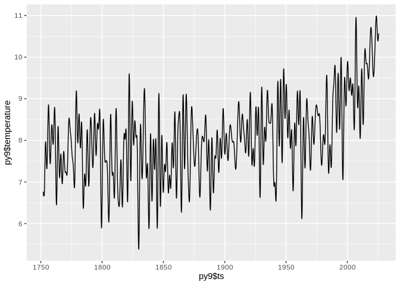
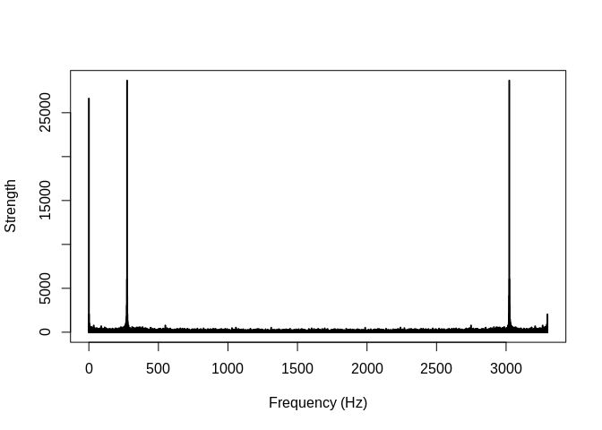
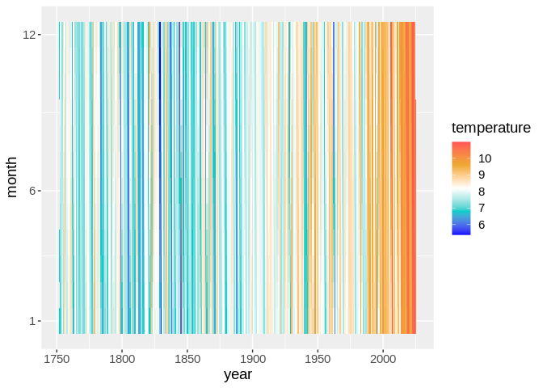
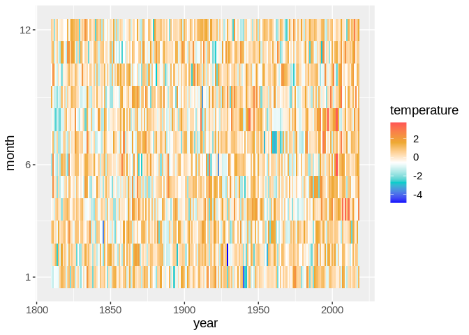
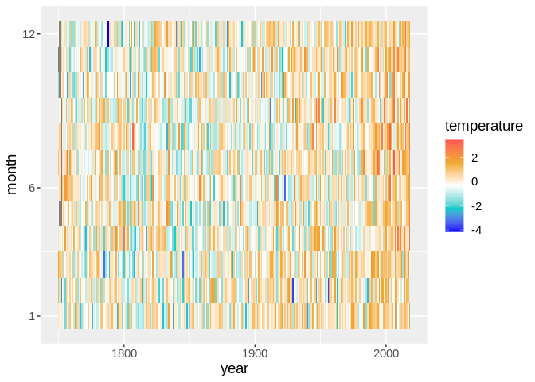

## Baur Serie


Monthly Temperature data of Central Europe (~Germany) as taken from
https://de.wikipedia.org/wiki/Zeitreihe_der_Lufttemperatur_in_Deutschland#Messwerte_in_Dekaden

### Create plain monthly series


```sh
python ./source/yearly_monthly.py
```


```r
#install.packages("ggplot2")
require("ggplot2")
```

```
## Loading required package: ggplot2
```

```r
color.temperature <- c("#0000FF", "#00CCCC", "#FFFFFF", "#EEAA33", "#FF5555")
#setwd(dirname(rstudioapi::getActiveDocumentContext()$path))
py <- read.csv("https://raw.githubusercontent.com/climdata/baur/master/csv/baur_monthly.csv", sep=",")
py2 <- subset(py, !is.na(py$temperature))
```

## Plot Month-Table


```r
mp <- ggplot(py2, aes(year, month))
mp + geom_raster(aes(fill=temperature))+
  scale_y_continuous(breaks=c(1,6,12))+
  theme(panel.background = element_rect(fill = '#EEEEEE', colour = 'white'), legend.position="right", text=element_text(size=14))+
  scale_fill_gradientn(colours=color.temperature)
```

<!-- -->

```r
#hist(py2$temperature)
```

## Plot more classical diagram


```r
mp <- ggplot()
jan <- subset(py2, py2$month == 1)
jul <- subset(py2, py2$month == 7)
mp + geom_line(aes(y=jan$temperature, x=jan$year), color="blue") + 
     geom_line(aes(y=jul$temperature, x=jul$year), color="red")
```

<!-- -->

```r
#hist(jan$temperature)
#hist(jul$temperature)
```

## Plot timeline


```r
mp <- ggplot()
mp + geom_line(aes(y=py2$temperature, x=py2$time)) 
```

<!-- -->

```r
py7<- fft(py2$temperature, inverse = FALSE)

border1 <- mean(Mod(py7)) + 1*sd(Mod(py7))
border2 <- 0.3*sd(Mod(py7))
py8 <- py7 
py8 <- replace(py8, Mod(py8)>border1, 0.0)
#py8 <- replace(py8, Mod(py8)<border2, 0.0)
py8[0:2] <- py7[0:2]
py8[(length(py8) - 3):length(py8)] <- py7[(length(py7) - 3):length(py7)]
#py8[10:14] <- 0.0
#py8[(length(py8) - 14):length(py8)-10] <- 0.0
py8[520:(length(py8) - 520)] <- 0.0
#py8[260:(length(py8)-260)] <- 0.0
py8[130:(length(py8)-130)] <- 0.0

#3198/12

py9 <- py2
py9$temperature <- Mod(fft(py8, inverse = TRUE))/length(py8)

py9 <- subset(py9, py9$year >= 1752)

mp <- ggplot()
mp + geom_line(aes(y=py9$temperature, x=py9$time)) 
```

<!-- -->

```r
  plot.data  <- cbind(0:(length(py7)-1), Mod(py7))

  # TODO: why this scaling is necessary?
  plot.data[2:length(py7),2] <- 2*plot.data[2:length(py7),2] 
  
  plot(plot.data, t="h", lwd=2, main="", 
       xlab="Frequency (Hz)", ylab="Strength", 
       xlim=c(0,length(py7)), ylim=c(0,max(Mod(plot.data[,2]))))
```

<!-- -->

```r
  py7 <- py8
  
    plot.data  <- cbind(0:(length(py7)-1), Mod(py7))

  # TODO: why this scaling is necessary?
  plot.data[2:length(py7),2] <- 2*plot.data[2:length(py7),2] 
  
  plot(plot.data, t="h", lwd=2, main="", 
       xlab="Frequency (Hz)", ylab="Strength", 
       xlim=c(0,500), ylim=c(0,5000))
```

<!-- -->

```r
  mp <- ggplot(py9, aes(year, month))
mp + geom_raster(aes(fill=temperature))+
  scale_y_continuous(breaks=c(1,6,12))+
  theme(panel.background = element_rect(fill = '#EEEEEE', colour = 'white'), legend.position="right", text=element_text(size=14))+
  scale_fill_gradientn(colours=color.temperature)
```

<!-- -->

```r
#hist(py9$temperature)
```

## Plot summer and winter of filtered set


```r
mp <- ggplot()
jan <- subset(py9, py9$month == 1)
jul <- subset(py9, py9$month == 7)
mp + geom_line(aes(y=jan$temperature, x=jan$year), color="blue") + 
     geom_line(aes(y=jul$temperature, x=jul$year), color="red")
```

<!-- -->

```r
#hist(jan$temperature)
#hist(jul$temperature)
```

## Work with yearly and moving/rolling normalization


```r
#install.packages("data.table")
library(data.table)
library(zoo)
```

```
## 
## Attaching package: 'zoo'
```

```
## The following objects are masked from 'package:base':
## 
##     as.Date, as.Date.numeric
```

```r
py3 <- read.csv("https://raw.githubusercontent.com/climdata/baur/master/csv/baur_yearly.csv", sep=",")
avg <- rollapply(py3, width=30, by=1, FUN=mean)
x <-tail(py3, n=-30)
std <- rollapply(py3, width=30, by=1, FUN=sd)

py4 <- (x-avg)/std
py4$year <- x$year
py4 <-tail(py4, n=-30)

tmp <-py4[,c("year","jan")]
names(tmp)[names(tmp) == "jan"] <- "temperature"
tmp$month <- rep(1,nrow(tmp))
norm <- tmp
m <- 2
for (month in c("feb","mar","apr","mai","jun","jul","aug","sep","oct","nov","dec")) {
  tmp <-py4[,c("year",month)]
  names(tmp)[names(tmp) == month] <- "temperature"
  tmp$month <- rep(m,nrow(tmp))
  m <- m+1
  norm <- rbind(norm, tmp)
}


mp <- ggplot(norm, aes(year, month))
mp + geom_raster(aes(fill=temperature))+
  scale_y_continuous(breaks=c(1,6,12))+
  theme(panel.background = element_rect(fill = '#EEEEEE', colour = 'white'), legend.position="right", text=element_text(size=14))+
  scale_fill_gradientn(colours=color.temperature)
```

<!-- -->

```r
#hist(norm$temperature)
```


## Work with yearly and fixed normalization


```r
#install.packages("data.table")
library(data.table)
library(zoo)

py3 <- read.csv("https://raw.githubusercontent.com/climdata/baur/master/csv/baur_yearly.csv", sep=",")

tmp <-py3[,c("year","jan")]
names(tmp)[names(tmp) == "jan"] <- "temperature"
avg <- mean(tmp$temperature, na.rm = TRUE)
std <- sd(tmp$temperature, na.rm = TRUE)
tmp$temperature <- (tmp$temperature-avg)/std
tmp$month <- rep(1,nrow(tmp))
norm <- tmp
m <- 2
for (month in c("feb","mar","apr","mai","jun","jul","aug","sep","oct","nov","dec")) {
  tmp <-py3[,c("year",month)]
  names(tmp)[names(tmp) == month] <- "temperature"
  avg <- mean(tmp$temperature, na.rm = TRUE)
  std <- sd(tmp$temperature, na.rm = TRUE)
  tmp$temperature <- (tmp$temperature-avg)/std
  tmp$month <- rep(m,nrow(tmp))
  m <- m+1
  norm <- rbind(norm, tmp)
}


mp <- ggplot(norm, aes(year, month))
mp + geom_raster(aes(fill=temperature))+
  scale_y_continuous(breaks=c(1,6,12))+
  theme(panel.background = element_rect(fill = '#EEEEEE', colour = 'white'), legend.position="right", text=element_text(size=14))+
  scale_fill_gradientn(colours=color.temperature)
```

<!-- -->

```r
#hist(norm$temperature)
```
