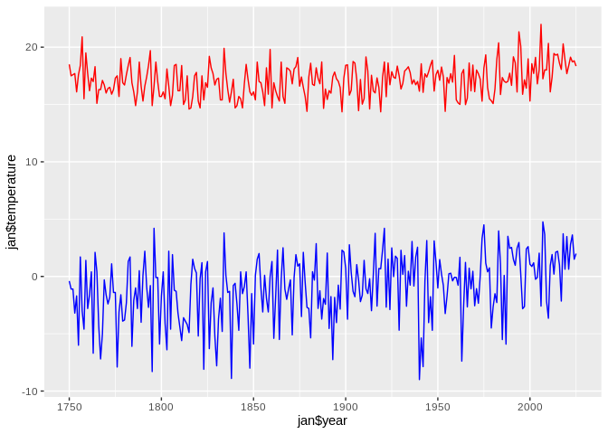

## Baur Serie


Monthly Temperature data of Central Europe (~Germany) as taken from
https://de.wikipedia.org/wiki/Zeitreihe_der_Lufttemperatur_in_Deutschland#Messwerte_in_Dekaden


```r
#install.packages("ggplot2")
require("ggplot2")
```

```
## Loading required package: ggplot2
```

```
## Warning: package 'ggplot2' was built under R version 3.5.3
```

```r
color.temperature <- c("#0000FF", "#00CCCC", "#FFFFFF", "#EEAA33", "#FF5555")
#setwd(dirname(rstudioapi::getActiveDocumentContext()$path))
py <- read.csv("https://raw.githubusercontent.com/climdata/baur/master/baur_monthly.csv", sep=";")
py2 <- subset(py, !is.na(py$temperature))
```

## Plot Month-Table

<!-- -->

## Plot more classical diagram

<!-- -->
